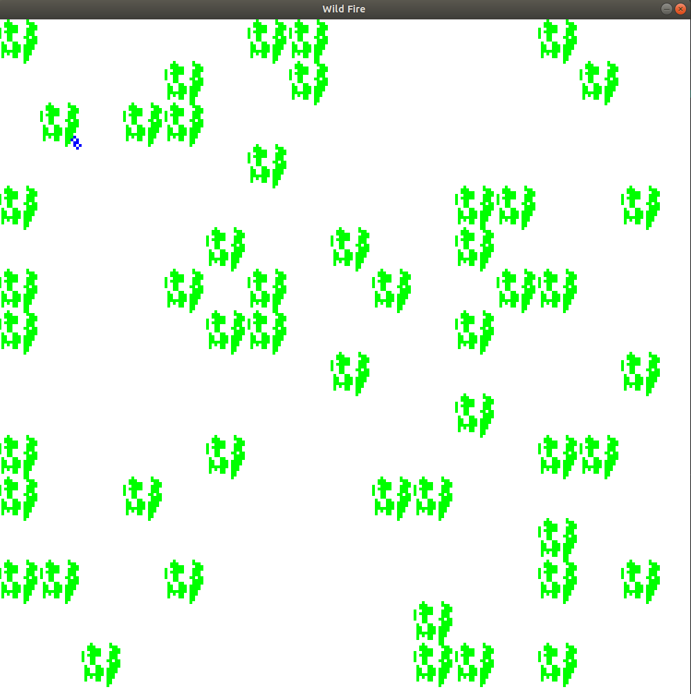
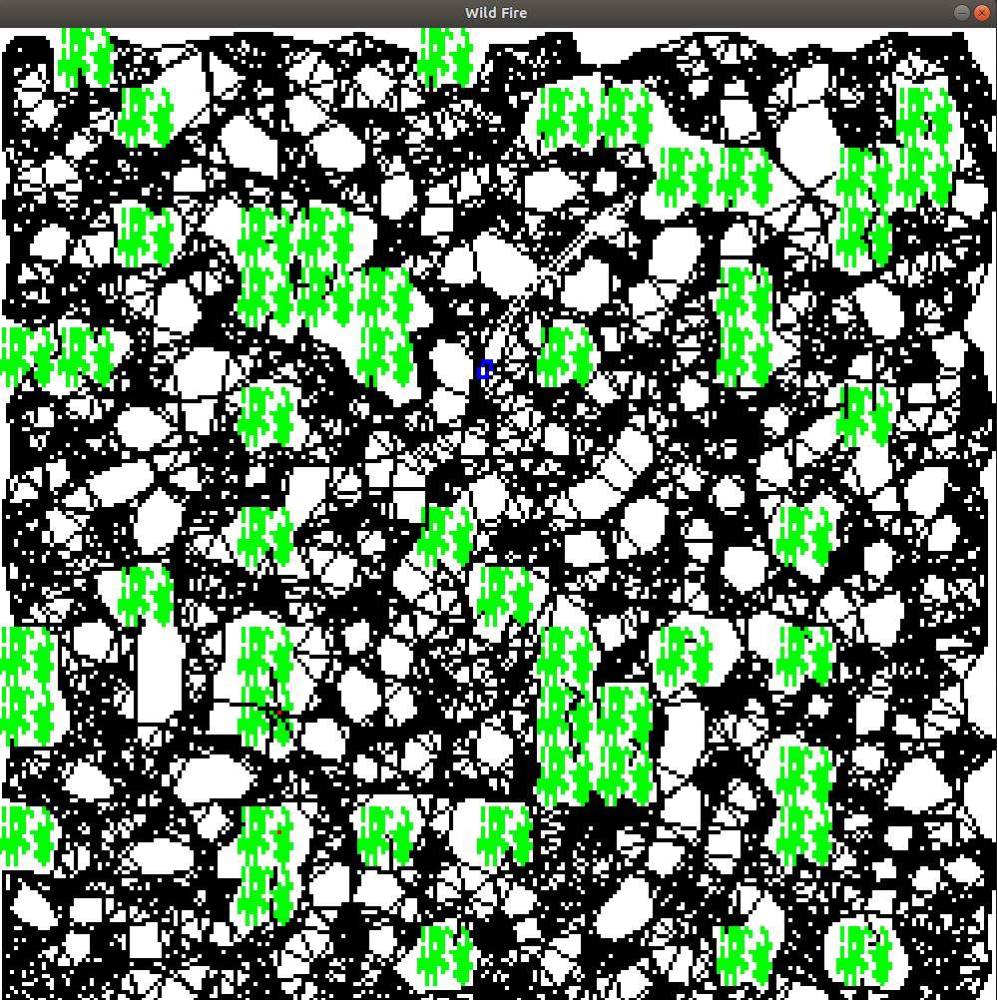

# Wild Fire (Implementation of A* and PRM)

This project involves the implementation of combinatorial (A*) and sampling-based (PRM) motion planning methods, in navigating a firetruck across the obstacle field in attempt to extinguish as many fires as possible.

## Environment

The environment consists of a flat square field, 250 meters on a side, filled with obstacles. The
obstacles consist of large patches of un-navigable thick brush, trees, and weeds.The base dimension for each
obstacle square unit is 15 meters. Inside this field, a firetruck operates, attempting to extinguish
fires that emerge.

Starting at time 0 and at 60 second intervals, an arsonist sets a major conflagration
at a random obstacle. This sets the obstacle state to burning. After 20 seconds in this state, the obstacle sets all obstacles within a 30 meter radius to the state of burning. 

The truck starts at a random point in the map. If the truck stops within 10 meters of a burning
obstacle, it sets the state to extinguished.

Two Planners are used to solve this problem
***
    1. A* Planner
    2. Probabilistic Roadmap (PRM)
***
The figure below shows the environment created. Green patches represent the bushes and blue box represent the car. The dimensions of the car are as follows:
***
    width - 2.2 meters
    length - 4.9 meters
    wheelbase - 3 meters
    minimum turning radius - 13 meters
    maximum velocity - 10 meters per second
***

## Implementation

1) A* Planner - To implement the A* planner, the next possible states were choosen according to the kinematic equation of the ackerman drive instead of grid-based search. The robot, considering it's dimensions, was placed at the possible states and the algorithm for collison check was executed. If there was no collison at the possible states, the state were considered to be valid. The cost function of the Planner includes the cost to travel from the current node to the next possible node and heuristic cost from the next possible state to the goal node.

The folder A_star include the required codes to exectue the A* planner. It includes
***
    1) main.py - The main file which calls the main function of the environment.py file.
    2) environment.py - This file creates the environment using pygame library. It also calls the A* planner which is in the A_star.py
    3) A_star.py - This file executes the A* planner.
    4) robot.py - This file creates and draws the robot in the environment. Also, it includes the collision checking algorithm.
    5) global_variables.py - This file include the global variables used in different .py files.
    
***
#### Execution 
***
    python main.py
***
#### Demonstration of A* Planner

https://user-images.githubusercontent.com/30457807/143119940-e4defdc8-41f5-48a9-aeff-184e3d755a6f.mp4

2) PRM - The roadmap was created before the start of the simulation. The start and the goal node was connected with the roadmap and global A* was applied to search the path between the start node and goal node, without considering collison check. After that, to travel between any 2 nodes obtained from the global A*, local A* was executed. While executing local A*, the collison check was not taken in consideration.  

The folder PRM include the required codes to exectue the PRM planner, Global A* planner and Local A* planner. It includes
***
    1) main.py - The main file which calls the main function of the environment.py file.
    2) environment.py - This file creates the environment using pygame library. It also calls the PRM Planner, Global A* planner and Local A* Planner.
    3) PRM.py - This file creates the probabilistic roadmap.
    4) A_star.py - This file contains the function of global as well as local A* planner.
    5) robot.py - This file creates and draws the robot in the environment. Also, it includes the collision checking algorithm.
    6) global_variables.py - This file include the global variables used in different .py files.
    
***

The figure belows shows the glimpse of Probabilistic Roapmap

#### Execution 
***
    python main.py
***

#### Demonstration of PRM, Global and Local A* Planner

https://user-images.githubusercontent.com/30457807/143120199-e0845d1a-22c7-4e8a-9d27-50ba70cde0ab.mp4

